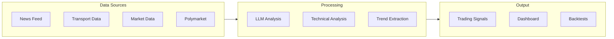

# Product Enhancement Plan: Trader

## Текущее состояние продукта

**Уникальные преимущества:**

1. **Alternative Data** - транспортные потоки (суда/самолеты) для сырьевых commodities
2. **LLM-powered анализ** - извлечение тегов и генерация сигналов из новостей
3. **Polymarket валидация** - проверка сигналов через prediction markets
4. **Мультирыночный охват** - крипто, ETF, S&P500, MOEX в одном месте

**Критические пробелы:**

- Transport data не визуализируется в UI
- Нет автоматизации (только manual approval сигналов)
- Нет performance tracking исполненных сигналов
- Нет уведомлений (telegram, email, push)
- Trends не доступен в навигации

---

## Целевые сегменты рынка

| Сегмент | Потребность | Ценность продукта |

| ---------------------- | -------------------------------------- | ------------------------------ |

| **Retail traders** | Быстрые insights без глубокого анализа | AI-сигналы, простой UI |

| **Quant funds** | Альтернативные данные | Transport data, API access |

| **Commodity traders** | Edge в сырьевых рынках | Vessel tracking, flow signals |

| **Prop trading desks** | Автоматизация research | News analysis, trend detection |

---

## Приоритетные улучшения

### Tier 1: Quick Wins (1-2 недели)

**1. Transport Dashboard**

- Добавить `/transport` страницу с визуализацией:
  - Карта с позициями судов/самолетов в реальном времени
  - Активные сигналы по commodities
  - Flow графики по регионам
- Route: добавить в [bloomberg-header.tsx](apps/web/src/components/bloomberg-header.tsx)

**2. Signal Performance Tracking**

- Трекинг P&L по исполненным сигналам
- Добавить поля в схему `signal`:
  - `exitPrice`, `exitAt`, `realizedPnl`, `holdingPeriod`
- Dashboard с метриками: win rate, avg return, sharpe

**3. Trends в навигацию**

- Trends уже реализован но не доступен в header
- Добавить в NavGroup в [bloomberg-header.tsx](apps/web/src/components/bloomberg-header.tsx)

**4. Telegram уведомления**

- При появлении нового сигнала
- При достижении take profit / stop loss
- Hot trend alerts

### Tier 2: Core Features (2-4 недели)

**5. Auto-trading Mode**

- Конфигурируемые правила автоисполнения:
  - Min strength threshold (e.g., 75+)
  - Max position size
  - Whitelist symbols
- Отдельный UI для настройки автоматизации

**6. Strategy Builder (No-Code)**

- Визуальный конструктор стратегий на базе:
  - Technical indicators (RSI, MACD, etc.)
  - News sentiment triggers
  - Transport signals
- Экспорт в Lean для backtesting

**7. Watchlist & Alerts**

- Персональные watchlists
- Custom alerts по техническим условиям
- Price alerts с push notifications

**8. Enhanced Transport Intelligence**

- Historical analysis: "What happened to oil price last time tanker flow dropped 20%?"
- Predictive analytics: expected commodity impact
- API endpoint для quant интеграции

### Tier 3: Premium Features (4-8 недель)

**9. Screener 2.0**

- Multi-factor screening:
  - Technical conditions
  - News sentiment
  - Transport signals
  - Polymarket probability
- Сохраняемые скринеры

**10. Portfolio Analytics**

- Risk decomposition
- Factor exposure analysis
- Correlation matrix visualization
- Rebalancing suggestions

**11. Social / Community**

- Signal sharing между пользователями
- Leaderboard по performance
- Copy-trading (follow signals)

**12. API & SDK**

- REST API для всех данных
- WebSocket для realtime signals
- Python SDK для quant workflows

---

## Модель монетизации

| Tier | Цена | Включено |

| -------------- | ------- | ------------------------------------------------------------- |

| **Free** | $0 | Market data, 3 signals/day, delayed news |

| **Pro** | $49/mo | Unlimited signals, realtime news, telegram alerts, 1 exchange |

| **Trader** | $149/mo | Auto-trading, portfolio optimization, unlimited exchanges |

| **Enterprise** | Custom | API access, transport data, white-label |

---

## Рекомендуемый порядок реализации

1. **Transport Dashboard** - это уникальная фича, которой нет у конкурентов
2. **Signal Performance** - без этого невозможно доказать ценность продукта
3. **Telegram notifications** - критично для engagement
4. **Auto-trading** - главный аргумент для апгрейда на платный план
5. **API** - открывает B2B сегмент

---

## Вопросы для уточнения

Прежде чем приступать к реализации, хотел бы уточнить:

1. Какой сегмент рынка приоритетный - retail traders или institutional/quant?
2. Готов ли бэкенд transport service к продакшен нагрузке или требует доработки?
3. Какой бюджет на OpenAI API учитывается в unit economics?
4. Есть ли требования по compliance (KYC, регуляторные)?
